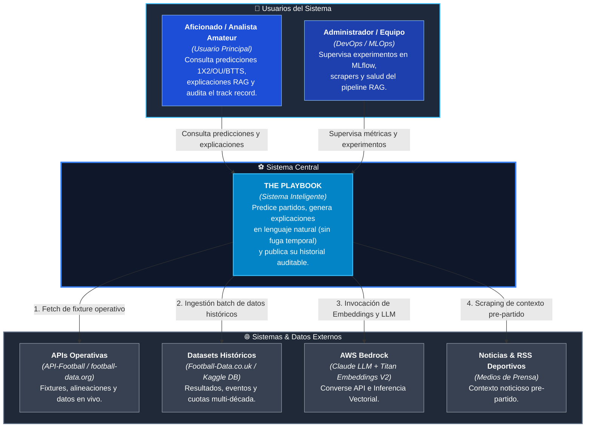
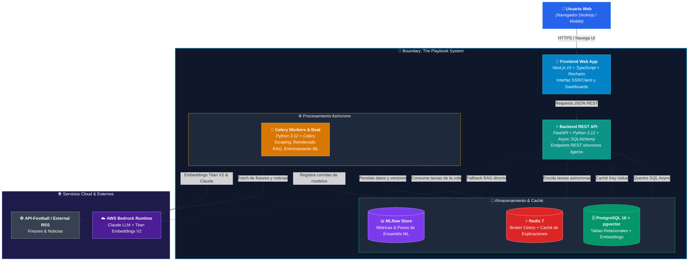
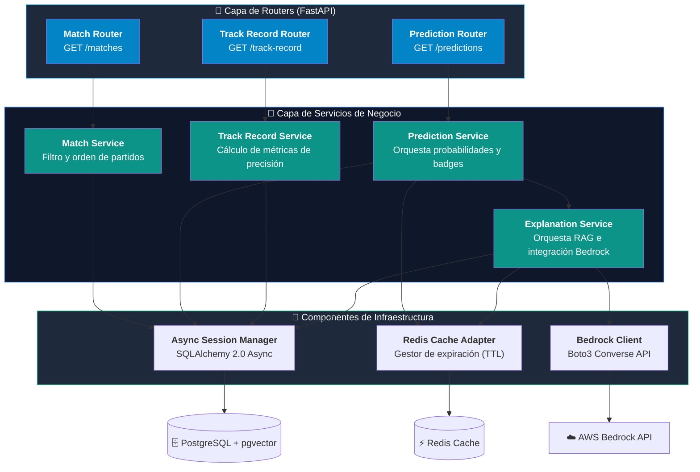
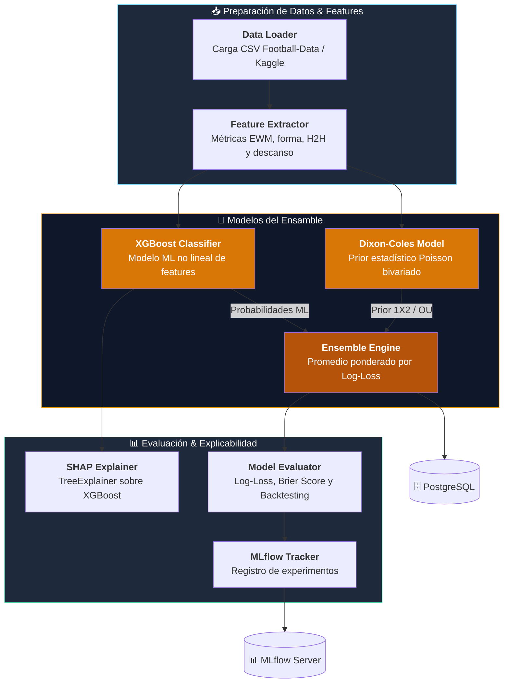
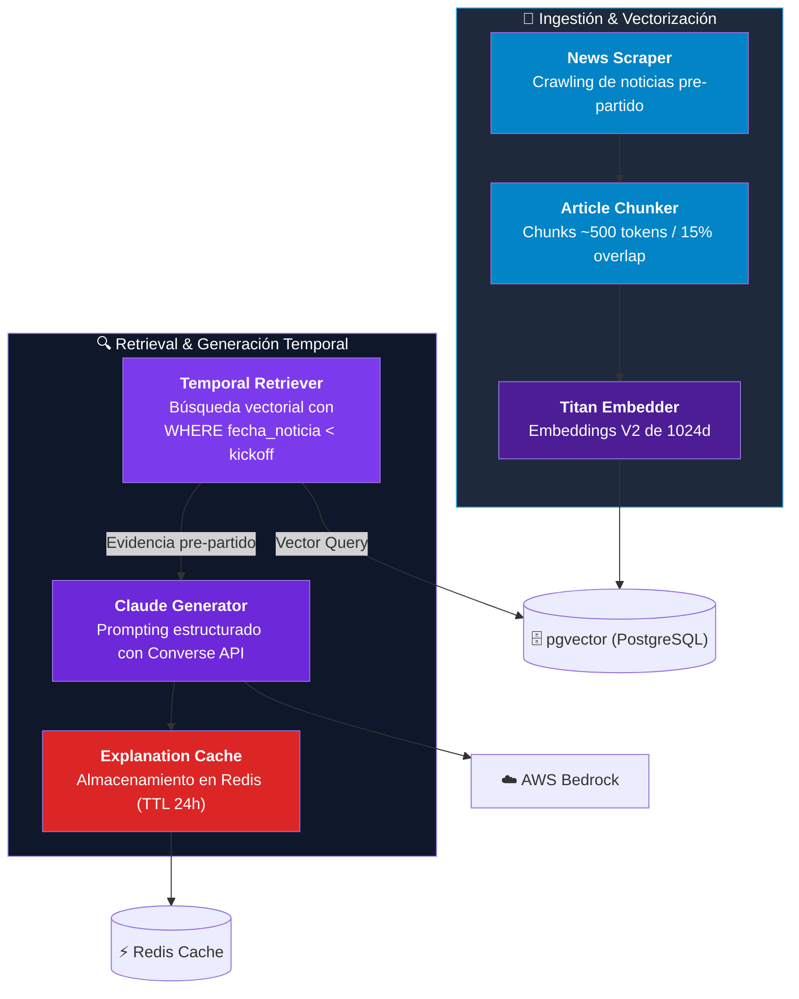
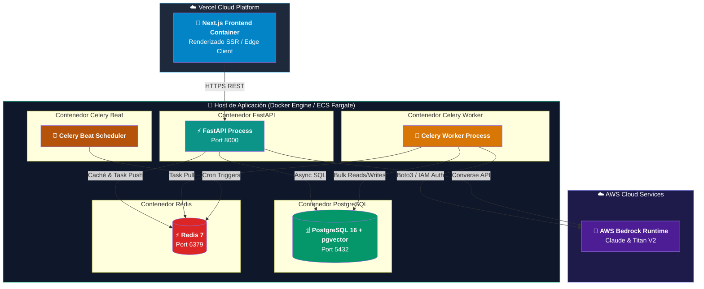
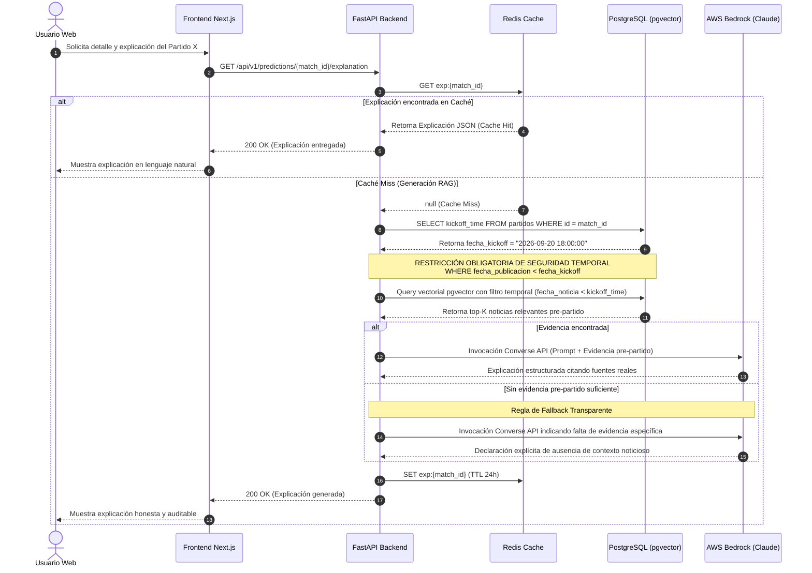

# Arquitectura de Sistema — Diagramas C4 de The Playbook

Este documento contiene la especificación arquitectónica del sistema **The Playbook** siguiendo el modelo **C4** (Contexto, Contenedores, Componentes y Despliegue/Secuencia). 

> 💡 **Nota de renderizado:** Los diagramas utilizan sintaxis `flowchart` de **Mermaid.js** con cajas estilizadas y saltos de línea explícitos para garantizar que en **Mermaid Live Editor**, **VS Code** y **GitHub** se vean alineados, nítidos y sin solapamiento de texto.

---

## 1. Nivel 1: Diagrama de Contexto del Sistema (System Context)

El diagrama de contexto muestra el sistema **The Playbook** en el centro, sus usuarios principales y la interacción con fuentes de datos e infraestructura de IA.

---

## 2. Nivel 2: Diagrama de Contenedores (Container Diagram)

Describe la distribución de responsabilidades en procesos y servicios independientes para garantizar la separación de tareas intensivas (ML/RAG) respecto al API servidor HTTP.

---

## 3. Nivel 3: Diagramas de Componentes (Component Diagrams)

### 3.1 Componentes del Backend API (`backend/app`)

---

### 3.2 Componentes del Subsistema de ML (`backend/ml`)

---

### 3.3 Componentes del Subsistema RAG (`backend/rag`)

---

## 4. Nivel 4: Despliegue y Flujo de Datos Temporal (Deployment & Data Flow)

### 4.1 Diagrama de Despliegue (Deployment Diagram)

---

### 4.2 Diagrama de Secuencia: Flujo Temporal Honesto de RAG

Garantía estricta de que **ninguna evidencia posterior al kickoff del partido ingresa al LLM**.

---

## 5. Resumen de Decisiones Clave de Arquitectura (ADR Summary)

| ID ADR | Título | Decisión / Razón |
|---|---|---|
| [ADR 0001](adr/0001-badge-confianza-calibrado.md) | Badge de Confianza Calibrado | El nivel de confianza (Alta/Media/Baja) se obtiene de la precisión histórica real calibrada en ese rango de probabilidad (backtesting cronológico), **nunca** de la distancia a una distribución uniforme (33/33/33). |
| Spec §4 | Aislamiento de Procesos | Ningún job pesado de reentrenamiento de ML o reindexado RAG se ejecuta en el proceso HTTP de FastAPI. Todo se canaliza mediante Celery Workers independientes. |
| Spec §5.1 | AWS Bedrock Standalone | Claude vía Converse API y Amazon Titan Text Embeddings V2 están centralizados en AWS Bedrock con autenticación gestionada mediante roles IAM. |
| Spec §6.4 | Ensamble Ponderado | Combinación de la distribución prior de Dixon-Coles con el modelo XGBoost mediante promedio ponderado ajustado por log-loss en validación cronológica. |
| Spec §7.3 | Filtro Temporal en Retrieval RAG | Restricción estricta a nivel de query (`fecha_noticia < fecha_kickoff`) para evitar fugas de información posterior al resultado. |
